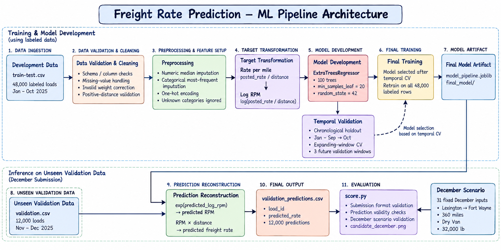

# Freight Rate Prediction

An end-to-end ML system for predicting freight load rates from shipment, route, equipment, market, and quote-level information — built around **time-aware validation, leakage-safe feature engineering, target transformation, error analysis, and reproducible training**, rather than a single optimized train/validation split.

---

## Overview

Freight pricing depends on pickup/delivery location, distance, equipment, weight, market conditions, quote signals, historical pricing patterns, and temporal effects. The core challenge is **temporal generalization** — a model can look excellent on historical data and degrade on a future month. The pipeline evolved from a simple baseline into a time-aware system designed around that constraint.



---

## Dataset

- **Development set**: 48,000 labeled loads, 2025-01-01 → 2025-10-31
- **Held-out validation set**: 12,000 loads, 2025-11-01 → 2025-12-31

| Feature | Description |
| --- | --- |
| `pickup` / `delivery` | Location names |
| `pickup_lat/lon`, `delivery_lat/lon` | Coordinates |
| `distance` | Shipment distance |
| `equipment` | Equipment type |
| `weight` | Load weight |
| `market_index` | Market condition signal |
| `quote_signal` | Quote-related signal |

Target: posted freight rate, transformed to **rate per mile** and then **log rate per mile** for modeling.

---

## Modeling Approach

**1. Baseline** — a tree-based regression baseline scored MAE $50.03 / RMSE $230.92 / R² 0.9757 on training vs. MAE $162.30 / RMSE $690.70 / R² 0.7958 on validation. The large train/validation gap became the driving problem for every experiment after this.

**2. Data quality** — 292 negative training weights were found and corrected before training; the same check runs in the final pipeline.

**3. Rate-per-mile target** — `posted_rate / distance` (mean 2.2153, median 2.1453, std 0.5839, range 0.3337–14.1253) lets the model learn pricing intensity independent of distance.

**4. Log target** — `log(rate_per_mile)` further reduced the influence of extreme values; predictions are reconstructed as `exp(predicted_log_rpm) × distance`.

---

## Experimentation

12 experiments (`experiments/EXP-001` … `EXP-012`), each with its own config and metrics:

| Experiment | Focus |
| --- | --- |
| EXP-001 | Initial baseline |
| EXP-002 | Weight correction |
| EXP-003 | Alternative model configuration |
| EXP-004 | Rate-per-mile target |
| EXP-005 | Log rate-per-mile target |
| EXP-006 | Historical pricing features |
| EXP-007 | Temporal features |
| EXP-008 | Explicit route features |
| EXP-009 | Combined target / feature refinement |
| EXP-010 | Model refinement |
| EXP-011 | Further model refinement |
| EXP-012 | Temporal cross-validation |

---

## Error Analysis

Post-EXP-004 analysis showed validation error growing with distance and varying by equipment — evidence used to guide later feature experiments.

| Distance | MAE | | Equipment | MAE |
| --- | ---: | --- | --- | ---: |
| ≤250 | $33.90 | | Dry Van | $119.13 |
| 251–500 | $59.71 | | Flatbed | $137.08 |
| 501–750 | $91.40 | | Reefer | $168.66 |
| 751–1000 | $111.19 | | | |
| 1001–1500 | $149.67 | | | |
| 1501–2000 | $200.00 | | | |
| >2000 | $247.82 | | | |

---

## Temporal Validation

A random split doesn't represent the deployment scenario — future loads must never influence historical training. **Expanding-window temporal CV** (EXP-012) confirms the selected configuration is stable across three future windows:

| Fold | Training | Validation | MAE | RMSE | R² |
| --- | --- | --- | ---: | ---: | ---: |
| 1 | Jan–Jun | Jul–Aug | $122.28 | $627.94 | 0.8225 |
| 2 | Jan–Jul | Aug–Sep | $118.59 | $619.98 | 0.8290 |
| 3 | Jan–Sep | Oct | $122.53 | $653.30 | 0.8173 |

**Mean MAE $121.13 (std $2.21)**, mean RMSE $633.74, mean R² 0.8230. Note: these are expanding-window (not independent) folds sharing training data, so this std likely understates true variance.

---

## Final Model

Trained on all 48,000 labeled rows (2025-01-01 → 2025-10-31), predicting on 12,000 validation rows (2025-11-01 → 2025-12-31). Predicts log rate-per-mile, converted back to freight rate.

**Prediction distribution**: min $178.71, median $2,002.81, mean $2,325.31, max $6,707.42.

The trained model is committed at `final_model/model_pipeline.joblib` — regenerated byte-for-byte by `scripts/train_final.py` (`random_state=42`).

---

## Reproducing the Project

```bash
git clone <repository-url>
cd freight-rate-prediction
pip install -r requirements.txt
python scripts/train_final.py
```

Regenerates `final_model/model_pipeline.joblib`, `predictions/validation_predictions.csv`, `final_model/config.json`, `final_model/prediction_summary.json`. Verified end-to-end in a clean virtual environment — no additional dependencies needed.

```bash
python score.py \
    --predictions predictions/validation_predictions.csv \
    --december-predictions predictions/december-chart-inputs.csv
```

---

## Key Engineering Lessons

1. **A strong training score doesn't guarantee generalization** — the $50→$162 MAE gap drove every later experiment.
2. **Validation strategy matters** — this task is temporal, so a random split would be overly optimistic; temporal CV reflects the real forecasting setup.
3. **Domain-derived targets matter** — rate-per-mile with a log transform outperformed predicting absolute rate directly.
4. **Error analysis should drive experimentation** — distance/equipment breakdowns pointed at where to focus feature work.
5. **More features aren't automatically better** — historical and calendar features were tried and didn't consistently improve future-month validation; validated improvements were prioritized over feature-count growth.

---

## Documentation

Full technical report: [`report/freight_rate_prediction_report.pdf`](report/freight_rate_prediction_report.pdf) (LaTeX source: [`report/freight_rate_prediction_report.tex`](report/freight_rate_prediction_report.tex)).

---

## Status

**Final training pipeline completed.** The repository contains the full experimentation history, temporal validation results, final trained model, predictions, evaluation tooling, and technical report.
